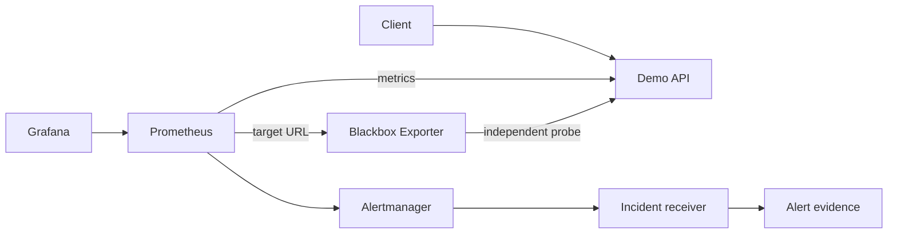

# AWS SLO & Error-Budget Dashboard

[](https://github.com/eamanze/aws-slo-error-budget-dashboard/actions/workflows/ci.yml)
[](https://github.com/eamanze/aws-slo-error-budget-dashboard/actions/workflows/terraform.yml)
[](https://github.com/eamanze/aws-slo-error-budget-dashboard/actions/workflows/security.yml)

A production-inspired SRE portfolio project that turns HTTP reliability into measurable service-level objectives. It provisions the complete local observability path, detects fast and sustained error-budget exhaustion, captures incident evidence, and supplies a hardened AWS ECS/Fargate deployment.

## What this demonstrates

- User-centered availability measured independently with Blackbox Exporter
- Request success and latency SLIs exported from a containerized Flask service
- A 99.5% rolling 28-day availability SLO and explicit error-budget policy
- Multi-window, multi-burn-rate alerts routed through Alertmanager
- Grafana dashboards and data sources provisioned as code
- Deterministic fault injection, load generation, runbooks, and incident reports
- Private ECS/Fargate tasks behind a multi-AZ ALB, with no SSH access
- CI for tests, configuration, Terraform, images, dependencies, and security reporting

## Architecture



The independent probe is important: application counters disappear when the process is down, whereas a user-visible availability SLI must record that outage. See [architecture decisions](docs/architecture.md).

## Quick start

Requirements: Docker with Compose, Python 3, and Make.

```bash
make up
make load-test
open http://localhost:3000
```

Grafana uses the credentials in `.env`, which `make up` creates from `.env.example`. Change them before sharing the environment. Local services are bound to `127.0.0.1`:

| Service | URL |
|---|---|
| Demo API | <http://localhost:8080> |
| Grafana | <http://localhost:3000> |
| Prometheus | <http://localhost:9090> |
| Alertmanager | <http://localhost:9093> |

Run the checks:

```bash
make test
make validate
```

## Reliability exercise

Inject a deterministic failure and keep traffic flowing:

```bash
make fault-errors
python3 load-tests/load.py || true
make fault-clear
```

For an automated exercise that runs long enough to exercise alert timing:

```bash
make incident
```

Alertmanager stores webhook events in a named volume; the exercise copies them to `artifacts/alert-events.jsonl` and creates a timestamped draft report. Complete its observed MTTD/MTTR and findings rather than presenting the generated template as a finished incident.

Other controlled experiments:

```bash
make fault-latency
make fault-clear
docker compose stop app  # black-box availability records a total outage
docker compose start app
```

## SLOs

| User experience | Objective | Window | Source |
|---|---:|---:|---|
| Successful external HTTP probe | 99.5% | rolling 28d | Blackbox Exporter |
| `GET /` completed within 500 ms | 99% | rolling 28d | Application histogram |

The dashboard also displays request success and p95 latency as diagnostics. Alert rules combine 5m/1h windows at 14.4x burn and 30m/6h windows at 3x burn. Full definitions and limitations are in [docs/slo.md](docs/slo.md); release policy is in [docs/error-budget-policy.md](docs/error-budget-policy.md).

## AWS deployment

Terraform creates:

- A VPC spanning two Availability Zones
- Public ALB subnets and private ECS task subnets
- An ECS/Fargate service with two tasks, health checks, rollback, and autoscaling
- Least-privilege task roles, restricted security groups, ECR scanning, and immutable tags
- CloudWatch logs/alarms and an optional AWS Budget notification
- Optional TLS 1.2/1.3 using an ACM certificate

Review [terraform/README.md](terraform/README.md) before deployment. The NAT gateway, ALB, and Fargate tasks incur ongoing charges. No infrastructure is applied automatically by CI.

## Repository map

| Path | Purpose |
|---|---|
| `app/` | API, Prometheus instrumentation, tests, and hardened image |
| `monitoring/` | Prometheus, Alertmanager, Blackbox Exporter, and Grafana configuration |
| `load-tests/` | Dependency-free load generator |
| `scripts/` | Repeatable fault and incident exercises |
| `runbooks/` | Alert-linked operational response procedures |
| `terraform/` | AWS ECS/Fargate infrastructure |
| `docs/` | Architecture, SLO, policy, security, and incident material |
| `.github/` | CI, security scanning, dependency updates, and contribution templates |

## Design limitations

- This is production-inspired, not a production claim. The application has no database or business dependencies.
- One NAT gateway controls lab cost but is not multi-AZ resilient.
- Local Prometheus provides the full SLO demonstration; AWS uses CloudWatch for baseline operational monitoring. A production extension would use Amazon Managed Service for Prometheus and Amazon Managed Grafana.
- Long-window metrics take time to mature. Exercise dashboards intentionally include short-window series.
- The fault API is enabled only in the local Compose environment and returns 404 in AWS.

## Documentation

- [Architecture and decisions](docs/architecture.md)
- [SLO specification](docs/slo.md)
- [Error-budget policy](docs/error-budget-policy.md)
- [Security model](docs/security.md)
- [Critical burn-rate runbook](runbooks/high-error-budget-burn.md)
- [Original learning guide](docs/original-implementation-guide.md)

## Cleanup

```bash
make down        # retain local metric volumes
make clean       # delete local metric volumes
terraform -chdir=terraform destroy  # only after reviewing the destroy plan
```

## License

[MIT](LICENSE)
