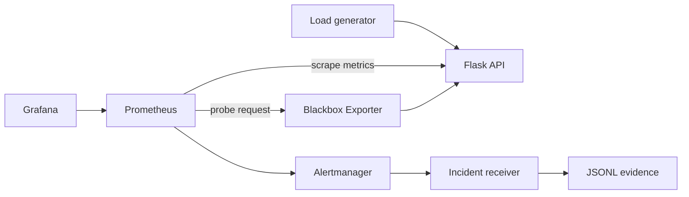
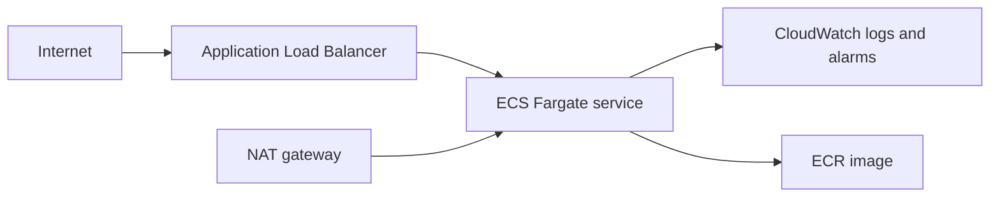

# Architecture and decisions

## Local

All host-published ports bind to loopback. Containers drop privileges where supported, the application filesystem is read-only, and configuration is provisioned from Git.

## AWS

The ALB spans public subnets. ECS tasks have no inbound internet path and run in private subnets across two Availability Zones. Tasks use an IAM execution role, encrypted logs, read-only root filesystems, deployment rollback, and target-tracking autoscaling. AWS Systems Manager/ECS Exec can be added for audited emergency access; there is no SSH listener.

## Deliberate trade-offs

- One NAT gateway limits lab cost but is an availability dependency. Use one per AZ for a production workload.
- The default listener is HTTP to keep the example deployable. Supplying an ACM certificate enables HTTPS and redirects HTTP.
- Local Prometheus/Grafana demonstrate SLO mechanics. The AWS deployment uses CloudWatch for baseline operations; a managed Prometheus/Grafana extension is a documented next step to avoid operating monitoring on a singleton VM.

